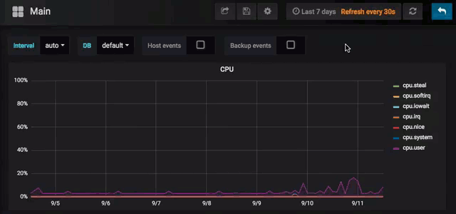
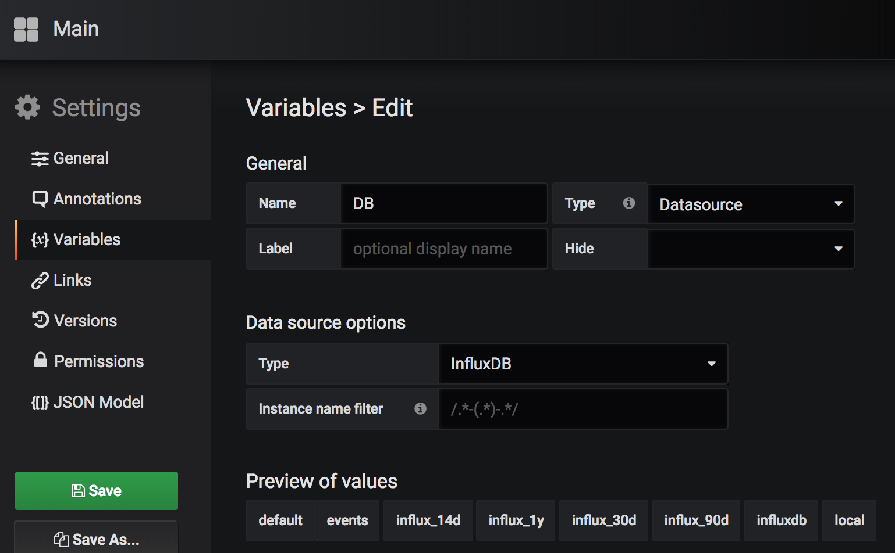

[](https://travis-ci.org/DrPsychick/ansible-influx-downsampling)

Configure influxDB for downsampling
===================================

Motivation:
-----------
InfluxDB uses a default retention policy that keeps data **forever** in 7 day shards - in RAW format (data points every 10 or 30 seconds, depending on your input configuration).
Of course this is a good default, but once you have old data and want to introduce downsampling without loosing data, its a **lot** of manual work to setup all the queries etc.

So ... I have done this for you!

Two usage scenarios:
* You already have an influxdb running and it's getting BIG, so you want to introduce downsampling on-the-fly to make things faster and cheaper
* You intend to use influxdb and want to set it up with downsampling in mind (so it does not grow big over time in the first place)

Honestly the two use cases are not much different. The biggest difference is the time it takes to run through the playbook when you enable backfilling. Of course, if you work on existing data, don't forget to have a proper backup!

Demo
----



This requires to setup a "database" variable, like so:



Preparation
-----------
As preparation you don't need much, expect knowing how exactly you want to downsample your data as you need to setup your configuration first.

Setup
-----

Easiest setup is create a role in your own repository and adding this:
* Decide on the name of the setup, let's call the role "influx-setup" and the setup "frank"
* *hint* you can have any number of setups configured in this role. You just always have to load first **your** role (defining the setup) and then **DrPsychick.ansible_influx_downsampling** for each setup.

`roles/influx-setup/tasks/main.yml`
```---

- name: "Include definition from influxdb_{{vars_name}}.yml"
  include_vars: influxdb_{{vars_name}}.yml
    when: vars_name is defined
```

`roles/influx-setup/vars/influxdb_frank.yml`
--> take one from the examples directory as a base for your own: [examples/](examples/)

Now in your playbook, include both roles:
`influx-setup.yml`
```
- name: InfluxDB 
  hosts: localhost
  roles: 
    - { role: influx-setup, vars_name: "frank" }
    - { role: DrPsychick.ansible_influxdb_downsampling}
```


Attention
=========
If you enable **backfill**:
* Check the size of your data first. Depending on the amount of series in a measurement, you need to configure the time range for backfilling. A good default is "1d" - but you may not want to run 365 queries for a year...
* Timeouts: Your InfluxDB as well as the calls in this playbook may time out! Or you may hit other limits in the influxdb.conf.
* Stats: They will **likely** crash because they query big time ranges with lots of data. Only turn them on for small backfill jobs.

My Settings for backfilling 9GB of data on 5 aggregation levels on a docker container with 3GB of RAM (no CPU limit for backfilling)
* `ansible_influx_databases`, 5 levels: 14d@1m, 30d@5m, 90d@15m, 1y@1h, 3y@3h (data only available for about 1 year)
* `ansible_influx_timeout`: 600 (10 minutes)
* influxdb.conf: 
  * `query-timeout="600s"`
  * `max-select-point=300000000`
  * `max-select-series=1000000`
  * `log-queries-after="10s"`
* backfill duration: 
  * 14 days :  42 minutes
  * 30 days :  38 minutes
  * 90 days :  80 minutes
  *  1 year : 120 minutes
  *  3 years: 170 minutes
  * compact7d: 42 minutes (switch source RP to 7d (compact))
  * **total**: 492 m ~8.5 hours
* Result
  * Series dropped from ~28k to 4k after compaction of source (9.6GB to 400MB)
  * `docker_container_blkio` takes the longest, maybe because of my multi-element where clause "/^(a|b|c|...)$/" and tons of generated container_names in the DB...
  * `influxdb_shard` had many data-points (had to increase influxdb.conf setting)
  * A small gap between backfilling and retention policy switch during compact

My full setup can be found in [examples/full-5level-backfill-compact/](examples/full-5level-backfill-compact/)

Use Cases
=========

* Just setup default RETENTION POLICY: [examples/basic.yml](examples/basic.yml)
* Clone RAW data into new RETENTION POLICY and drop old data: [examples/compact.yml](examples/compact.yml)
* Full 5 level downsampling including compaction: [examples/full-5level-backfill-compact/](examples/full-5level-backfill-compact/)

History
=======

Future Version:
* [ ] refactor/cleanup variables + introduce "mode" = setup, migrate, compact with separate task files
* [ ] add changed_when conditions
* [ ] add RP shard duration option
* [ ] backfill gap twice or until it is below x=1 minute (to keep gap as small as possible)

Version 0.3: Complete incl. automatic compaction, tests and good examples.

* [x] multiple/full examples -> see examples/
* [x] more tests:
   * [x] run backfill without CQ during operation and switch RP
   * [x] setup with 2 levels and CQ
   * [ ] recreate CQs
* [x] howto switch retention policy (cleanup after all is setup)
   * [x] Case: copy from "autogen", no CQ, drop source after backfill + set default RP -> see test
* [ ] shift RPs by "spread" seconds: 60+/-5sec EVERY 5m+-1s,2s,3s,... + step in seconds : use time(1m,1s) for offset!

Version 0.2: Fully working and tested. No deleting of data. Stats + CQ update.

* [x] Update description + basic readme
* [x] Check variables upfront (define clear dependencies) and print useful error messages before acting
* [x] fix: continuous_query is required even if empty (bad usability)
* [x] more tests: 
   * [x] test parallel tests
   * [x] prepare seeding (generator or file?)
   * [x] run downsampling + backfill on existing DB (needs seed)
   * [x] run backfill with step X (on RP with 7d)
* [x] set RP default yes/no
* [x] improve/extend dict structure (BC break!)
* [x] update continuous queries (drop+create)
* [x] stats (total data points written per DB / average downsampling ratio)
* [x] support selective group by in backfill and continuous query

Version 0.1:

* basic functionality
* create databases + retention policy
* backfill measurements
* create continuous queries
